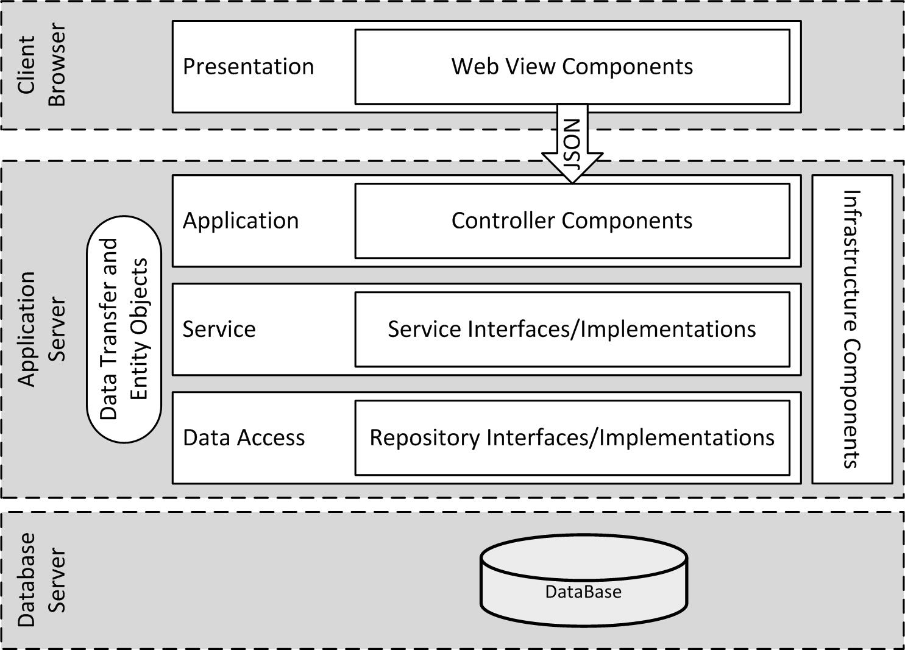

# Knowledge Article Record Management Application (KARMA) - Technical Approach

## The Essentials

The KARMA prototype is deployed on Amazon Web Services and can be accessed through the site URL: 

**<https://acceptance.bigbluesign.com>**  

Login information is available on the landing page.  The _User_ account will provide access to basic services for knowledge article creation and retrieval.  All common _User_ account services are accessible from the _Dashboard_ which serves as the _Home_ page and is automatically loaded upon successful login.  Additional _User_ account services for metadata management are available from the _Manage_ menu.  The _Admin_ account provides access to the _Administration_ menu which includes several application management and monitoring services.

## Product Vision

As a provider of custom application development solutions, the company creates a lot of knowledge regarding management processes, technical processes, and technical solutions.  Much of this knowledge can be applied across multiple products with some tailoring for different teams and solutions and some evolution for new techniques and technologies.  The company envisions a knowledge management application that can store this knowledge and make it easier to share, reuse, and adapt across products.  Initially, the application will facilitate efficient storage and retrieval of relevant knowledge; however, the ultimate vision is for the application to apply artifical intelligence techniques to suggest relevant knowledge and automatically adapt it to match product requirements and delivery teams.

# Prototype

Stanfield Systems applied their [Agile Delivery Process](#agile-delivery-process) to identify application features and define the application architecture and technologies.

## Application Features

* Login to the application so that content can be tailored for a particular user.  
* Create and edit knowledge articles for sharing with other users
* Find and retrieve knowledge relevant to a particular user
* Provide a single location (dashboard) to access knowledge relevant to a particular user

## Application Architecture and Technologies

Stanfield Systems implemented KARMA using open source technologies in a multi-tiered architecture as shown in the figure below. Our standard architecture and corresponding technologies are described in our [Technical Architecture](https://github.com/StanfieldSystems/KARMA/wiki/Technical_Architecture#technical-architecture) along with examples.

The Presentation tier runs in a client browser and is implemented with **Model-View-Controller JavaScript/TypeScript patterns** using **[Angular 5](https://github.com/StanfieldSystems/KARMA/wiki/Technical_Architecture#angular4client-project)**. The Angular Client uses HTTP to make calls to the RESTful API on the application server, using **JSON** to exchange information between the client and the application server.

RESTful web services are implemented on the application server as Java components using the **[Spring Boot framework](https://github.com/StanfieldSystems/KARMA/wiki/Technical_Architecture#springbootangularintegration-project)**. The application server includes several application tiers, as follows.

* The **application** tier implements controller classes with methods that define the rest end points and services. Controller objects control application activity that occurs when a rest services is invoked via the JSON interface. Controller objects implement the **Spring Web MVC Controller API**.

* The **service** tier implements service classes with methods that define business and data management services. Service objects define the scope of business transactions within the application, defining the steps to complete a transaction and persist or retrieve the results as appropriate. Service objects validate data inputs and relationships, enforce user authorization, and handle exceptions. Service objects implement the **Spring Service API**.

* The **data access** tier implements repository classes to manage the retrieval and storage of business information from the persistent data repository.  Repository objects leverage the object-relational mapping annotations in the Entity Objects to map business objects to database tables using the **Java Persistence API (JPA)**. Repository objects implement the **Spring Data Repository API**.

Information is exchanged between components in the different tiers using entity objects, data transfer objects, and additional parameters as necessary.

* **Entity Objects** are in-memory representations of business entities that are persisted in the database. Relational database tables and columns are mapped to entity objects using the **Java Persistence API (JPA) 2.0** annotations. 

* **Data Transfer Objects (DTOs)** are convenience objects used to group data together for transfer between components or processes. More specifically, DTOs are used for converting data from one or more entity objects to JSON when the mapping from entities to JSON data structures is somewhat complex.

In this multi-tier architecture, some services are shared across multiple services. These are depicted in the figure above as **Infrastructure Components**.

* [Logging](https://github.com/StanfieldSystems/KARMA/wiki/Technical_Architecture#logging) is implemented with **Log4j2**.
* [**Swagger**](https://github.com/StanfieldSystems/KARMA/wiki/Technical_Architecture#swagger-2) is used to describe and document RESTful APIs in accordance with the **OpenAPI Specification** _(RFI Requirement f)_.  To access this API documentation, login to KARMA as the admin user and select [_API_](https://acceptance.bigbluesign.com/#/docs) from the _Administration_ menu.

Business information is persisted in a [**PostgreSQL**](https://github.com/StanfieldSystems/KARMA/wiki/Technical_Architecture#postgresql) relational database. 

#  Agile Delivery Process

Stanfield Systems applies a [Scrum-Based, Disciplined Agile Delivery (DAD)](https://github.com/StanfieldSystems/KARMA/wiki) life-cycle for product development and release.  Stanfield Systems' DAD life-cycle is referenced throughout this documented with links to relevant process descriptions in the [KARMA GitHub Wiki](https://github.com/StanfieldSystems/KARMA/wiki).

## Inception

Stanfield Systems begins product development with a short [Inception Phase](https://github.com/StanfieldSystems/KARMA/wiki/Inception)  to achieve concurrence on the direction the team will take to deliver the product.  For the KARMA prototype, this phase lasted a single sprint (Sprint 0) and included the following activities.

### Form Team
_(RFI Requirements a, b)_

Applying our [guidelines for forming agile teams](https://github.com/StanfieldSystems/KARMA/wiki/Form_and_Evolve_Team), Stanfield Systems established a six person team to develop the KARMA prototype and prepare documentation for the RFI response.  This multidisciplinary and collaborative team includes 8 of the PQVP AD-DS Labor Categories as specified below.

- Product Manager (Christine Cox)
- Technical Architect (Patrick Grogan)
- Interaction Designer/User Researcher/Usability Tester (Diana Persell)
- DevOps Engineer (Patrick Grogan)
- Delivery Manager (Tim Jacobs)
- Agile Coach (Patrick Grogan)
- Business Analyst (Christine Cox)
- Full Stack Developer #1 (Kamal Singh)
- Full Stack Developer #2 (Aben Kebede)

The Product Manager is the team leader with authority and responsibility for successful delivery of a quality working prototype.

### Explore Initial Scope
_(RFI Requirements c, d)_

_(Tie in [Explore Initial Scope](https://github.com/StanfieldSystems/kmt/wiki/Explore_Initial_Scope) process description)_

Applying user-centered design techniques Stanfield Systems worked directly with users to understand what the users need to perform their tasks.  These user-centered techniques address the entire user experience from start to finish.

_(Summarize techniques and results here.  Reference process and result artifacts.)_

Based on our user-centered research and the prototype requirements from the RFI, we identified the following high-level user stories which were documented as epics for our initial product backlog.

* Login to the application so that content can be tailored for a particular user.  
* Create and edit knowledge articles for sharing with other users
* Find and retrieve knowledge articles relevant to a particular user
* Provide a single location (dashboard) to access knowledge relevant to a particular user
* Define rules for creating knowledge articles in a consistent format
* Approve and publish articles using a pre-defined workflow
* Control access to knowledge articles based on roles and business rules
* Notify users when the status of relevant articles is changed
* Assess the value of knowledge articles based on usage and feedback
* Define work flow rules for life-cycle management of knowledge articles
* Review new or modified knowledge articles prior to approval
* Provide access to system features for users with disabilities

### Develop Release Plan

Since the delivery date for the prototype is fixed, release planning was really about determining the minimal viable product that could be developed by the delivery date.  We focused on key issues identified during our initial user research (stakeholder interview) and contextual inquiry.  This led to a prioritization of the dashboard display to provide rapid access to articles of interest with dependencies on logging in, knowledge creation, and finding relevant knowledge.  These four epics were the focus of our minimal viable product for the release.

Release planning was complicated somewhat due to dependencies between user-centered design and related development activities.  To overcome these dependencies we performed initial development and user-centered design activities in parallel during Sprint 1.  In Sprint 2, we then refactored the working application to incorporate user centered design results.  We performed usability testing early in Sprint 3 and incorporated some of the findings into the application.  Other usability findings were added to the product backlog for prioritization after the initial prototype release.

### Technical Strategy and Work Environment
_(RFI Requirements e, f, g, h, k, l, m, o, p, r, t)_

For the KARMA prototype, Stanfield Systems' technical strategy is based on their [Work Environment Standards](https://github.com/StanfieldSystems/KARMA/wiki/Work_Environment_Standards).  All technologies and platforms used to create and run the prototype are openly licensed and free of charge _(RFI Requirement t)_.  (Note:  Amazon Web Services and Atlassian Cloud Services to incur minimal hosting costs.)  

#### Version Control and Configuration Management
_(RFI Requirement e, p)_

All application code files, including database scripts, are stored and managed in this [**GitHub**](https://github.com/StanfieldSystems/KARMA) version control repository.

[**Liquibase**](https://github.com/StanfieldSystems/KARMA/wiki/Technical_Architecture#liquibase) is used to migrate versioned database changes to developer, integration, and production database servers within the continuous integration and build pipeline.

#### Continuous Integration and Deployment
_(RFI Requirement m, o, p, q, r, s)_

#### Accessibility
_(RFI Requirement g, k)_

Accessibility and Section 508 compliance is incorporated into our agile delivery process as described in our [Accessibility](https://github.com/StanfieldSystems/KARMA/wiki/Accessibility) guidelines and procedures.  We check for proper implementation of accessibility guidelines through peer reviews, automated Behavioral Driven Development tests, static analyzers, and manual testing using accessibility browser tools.  

The Angular 5 client integrates **Bootstrap** libraries to present a responsive design that works on multiple devices with varying screen resolutions.

#### Style Guide
_(RFI Requirement h)_

#### Behavior (Test) Driven Development
_(RFI Requirement n)_

Stanfield Systems implements Test Driven development using an automated Behavior Driven Development process in accordance with our [Test Strategy](https://github.com/StanfieldSystems/KARMA/wiki/Initial_Test_Strategy).  We use [Cucumber](https://cucumber.io/docs) as the BDD framework, [Serenity](http://www.thucydides.info/) for reporting, [REST Assured](https://github.com/serenity-bdd/serenity-documentation/blob/master/src/asciidoc/serenity-rest.adoc) for making REST calls, and [Selenium](http://www.seleniumhq.org/) for driving the web.  

* [BDD Process and Configuration](https://github.com/StanfieldSystems/KARMA/wiki/Technical_Architecture#prototypebdd-project)
* [KARMA BDD Test Results](https://s3-us-west-2.amazonaws.com/stanfield-systems-karma-ci/karma-angular/index.html)

Stanfield Systems also generates automated JUnit tests for complete coverage of the application code.  

* [Unit Testing Process and Configuration](https://github.com/StanfieldSystems/KARMA/wiki/Technical_Architecture#unit-testing)
* [KARMS Unit Test Results]

#### Project Management and Collaboration

Stanfield Systems uses the [Jira](https://www.atlassian.com/software/jira) issue tracking system to manage product and sprint backlogs.

* Major features of the application are tracked as _Epics_ 
* Specific user requirements are tracked as _User Stories_.
* Design, development, administrative, or management activities are tracked as _Tasks_ or _Subtasks_
* Defects and technical debt are tracked as _Bugs_ or _Issues_
* Risks are tracked as _Risks_

Stanfield Systems uses the [Confluence](https://www.atlassian.com/software/confluence) project collaboration portal to manage artifacts created during the development process.  For the KARMA prototype, these artifacts are also incorporated into GitHub - as files in the _docs_ folder of the code repository or as markdown articles in the project _Wiki_.

##
