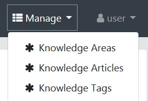

# KARMA User Guide

Login information is available on the landing page.  Users login from the Account menu at the top right.

There are two types of users.

1.  User - The _User_ account will provide access to basic services for knowledge article creation and retrieval.  All common _User_ account services are accessible from the _Dashboard_ which serves as the _Home_ page and is automatically loaded upon successful login.  Additional _User_ account services for metadata management are available from the _Manage_ menu.  
2. Administrator - The _Admin_ account provides access to the _Administration_ menu which includes several application management and monitoring services.  

There are three basic classes of data in the application:

1. Knowledge Article - User created content that documents knowledge.
2. Knowledge Area - User created category for associating related knowledge articles.
3. Knowledge Tags - User created labels to identify topics within a knowledge article.

## Dashboard

The KARMA home page is a dashboard that provides efficient access to articles of interest to the logged in user.  

* Users can navigate to knowledge articles or other pages in the application by selecting a blue link of interest.  Many of these links are organized into several categories on the dashboard.
    * My Recent Articles - Knowledge articles that have been recently accessed by the logged in user.  Result is a view of the selected article.
    * My Recent Knowledge Areas - Knowledge Areas that have been recently accessed by the logged in user.  Result is a list of knowledge articles in the selected Knowledge Area.
    * My Recent Tags - Knowledge Tags for which the logged in user has recently accessed a tagged article.  Result is a list of knowledge articles with the selected tag.
    * Popular Articles - most frequently accessed knowledge articles by all users of the system.  Result is a view of the selected article.
* In addition to the links organized by category, there are several links that can be used to browse all content of a particular type. 
    * All Articles - displays a list of all knowledge articles
    * All Knowledge Areas - displays a list of all knowledge areas
    * All Tags - displays a list of all tags.
    
    These links are equivalent to the menu items in the "Manage" menu.
    

* Users can create new knowledge articles by selecting the green "Create new Knowledge Article" button.
* Users can search for knowledge articles (by title) by entering key words in the search bar (labeled "Search Articles") and selecting the "Search" button.  Results will be presented as a list of knowledge articles.

## Create New Knowledge Article
* Users can create new knowledge articles from the dashboard by clicking the green "Create new Knowledge Article" button.
* A red panel on the left of the creation page indicates a mandatory field.

* Enter the title of the knowledge article, create the content, and scroll to the bottom of the page to select the knowledge area that best categorizes the article, and one or more knowledge tags.
* Once the user clicks the Save button, the knowledge article should display on the dashboard.

## Edit Knowledge Article

* While users can edit an existing knowledge articles by selecting a title of any article on the dashboard, it is most efficient in this iteration to select from All Articles.
* Click the Edit button to the right of the article the user wishes to edit, edit any field, and click the Save button.
* Users can also edit an existing article from My Recent Articles or Popular Articles, but the user must scroll to the bottom of the knowledge article and click the Edit button. 

## Delete Knowledge Article

* Users can delete existing knowledge articles from the dashboard by selecting All Articles.
* Click the Delete button to the right of the article the user wishes to delete.

## Administrator Tools

If a user is logged in as an _Admin_ user, additional tools are available from the _Administration_ menu for monitoring and administering the application.  These tools have not been fully validated for the prototype.

* **User Management** - Provides a list of users from with the administrator can create, edit, or delete users and specify their roles.
* **Metrics** - Detailed view of application performance using _Dropwizard_ metrics.
* **Health** - Metrics regarding application health using _Spring Boot Actuator's_ health endpoint.
* **Configuration** - Details about the application endpoints that have been configured.
* **Audits** - Logs status of user authentication attempts.
* **Logs** - Displays the status of loggers enabled for the application.
* **API** - Provides access to documentation of the API for KARMA.  Administrators can drill down to view (and execute, if authorized) API services.

